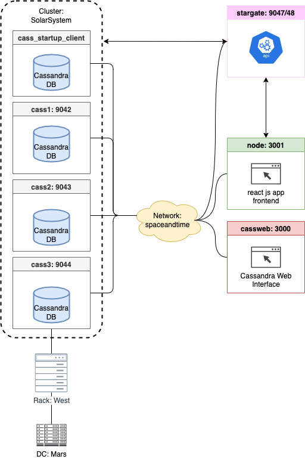
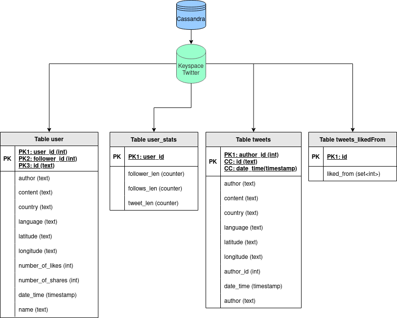

[](https://github.com/Miracle-Fruit/distributed-nosqldb/actions/workflows/main.yml)

# Kikeriki - Social Network with Cassandra and React run in Docker 


[](https://gitpod.io/#https://github.com/Miracle-Fruit/distributed-nosqldb)

## Documentation

Find the detailed lessons learned [here](lessons-learned.md).

Find the sample queries this project is built around [here](https://github.com/Miracle-Fruit/kikeriki/blob/main/cassandra/README.md).

## Architecture

### Infrastructure



### Database



## Setup

## Gitpod Setup

Gitpod starts with executing `make cass` and then opens two browser windows for Cassandra Web and the Frontend Website. Due to development reasons this is currently disabled and needs to be started manually.

### Makefile 

The Makefile allows to run different setups:

```bash
# Run Neo4j enterprise edition with cluster setup
make neo4j-ent

# Run Neo4j community edition (single instance)
make neo4j-com

# Run Cassandra Cluster with three nodes
make cass
```

### React Frontend

The frontend is build with [Create React App](https://github.com/facebook/create-react-app).

### Cassandra Cluster Details

Cassandra Cluster with three nodes can be accessed via web the interface at http://localhost:3000/

**Useful commands:**
* `docker exec cass1 nodetool status` (status check) --> UN = Up and Normal
* `docker exec -it cass1 cqlsh` (open cqlsh)
