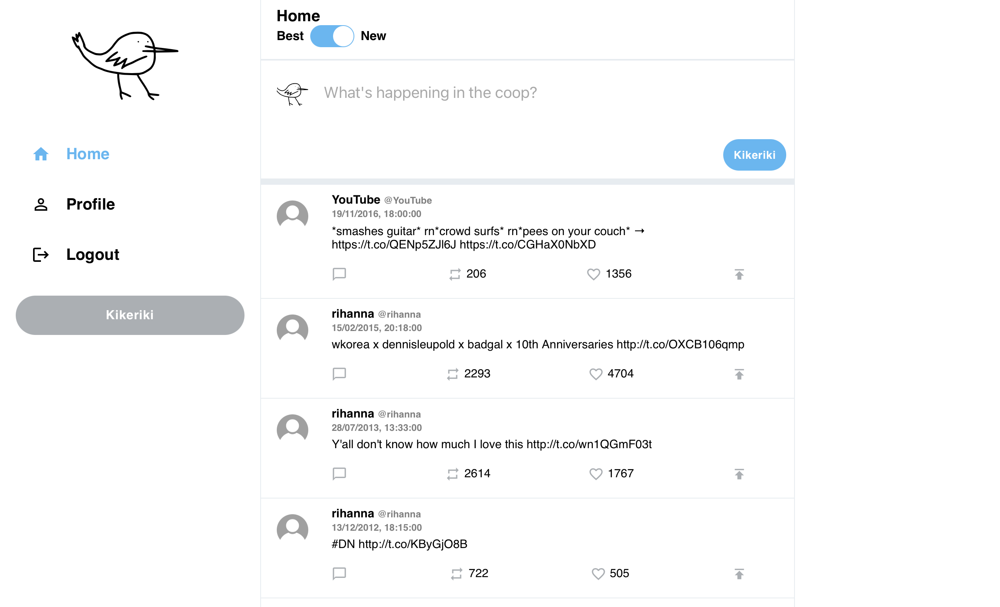
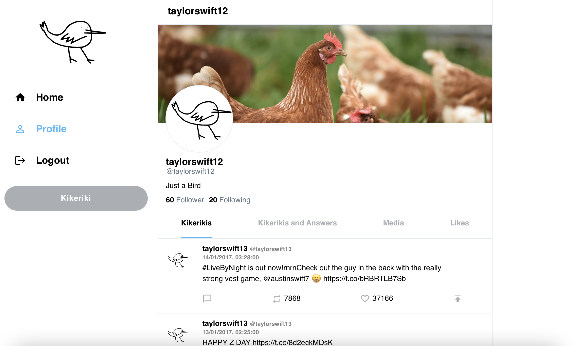

[](https://github.com/Miracle-Fruit/distributed-nosqldb/actions/workflows/main.yml)

# Kikeriki - Social Network with Cassandra and React run in Docker 


[](https://gitpod.io/#https://github.com/Miracle-Fruit/distributed-nosqldb)

## Documentation

Find the detailed lessons learned [here](lessons-learned.md).

Find the sample queries this project is built around [here](./cassandra/README.md).

Find the explanation for the Table structure [here](structure.md).


All of these Files are also available as PDF in the [PDF Folder ](./pdf/)

The preprocessing python script is [here](./cassandra/startup/setup/cleaning.py) 


## Architecture

### Infrastructure


### Database


## Getting Started
Currently we only implemented the full setup for cassandra. So only ```make cass``` fully works. It takes about 30min to fully load the data after entering the command, so go and get some coffee.


## Gitpod Setup

Gitpod starts with executing `make cass` and then opens two browser windows for Cassandra Web and the Frontend Website. Due to development reasons this is currently disabled and needs to be started manually.

The react and cassandra frontend should open automaticly, if not the react frontend runs on Port 3001 and the cassandra frontend on Port 3000. 

### React Frontend

The frontend is build with [Create React App](https://github.com/facebook/create-react-app).


It runs on Port 3001

It supports the following features:
* Login with userID and username
* View your feed sorted by likes or date (see kikerikis of people you follow)
* View your profile to see your kikerikis sorted by date and to see your follower and follows count
* Send new kikerikis

### Sources we used for the frontend design:
* https://github.com/danielbarrosdeoliveira/twitter-login-clone-html-css
* https://github.com/RisingGeek/twitter-clone
* https://github.com/CleverProgrammers/twitter-clone


### Cassandra Cluster Details

Cassandra Cluster with three nodes can be accessed via web the interface at http://localhost:3000/

**Useful commands:**
* `docker exec cass1 nodetool status` (status check) --> UN = Up and Normal
* `docker exec -it cass1 cqlsh` (open cqlsh)


### Makefile 
The Makefile allows to run different setups:

For the neo4j-ent command to work, you need to change ```NEO4J_ACCEPT_LICENSE_AGREEMENT``` to ```yes``` (which means you own a Enterprise license)
```bash
# Run Neo4j enterprise edition with 4 nodes
make neo4j-ent

# Shuts down the Neo4j enterprise cluster
neo4j-ent-shutdown

# Run Neo4j community edition (single instance)
make neo4j-com

# Run Cassandra Cluster with three nodes
make cass

# Run Query 2 and 3 on Cassandra Cluster using python
make cass-ex2_3

# Run scylla Cluster
make scylla

# Run redis Cluster
make redis
```
