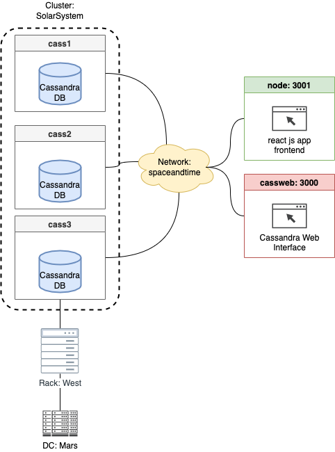

# Social Network with Distributed NoSQL DBs

[](https://gitpod.io/#https://github.com/Miracle-Fruit/distributed-nosqldb)

## Ideation

* Neo4j clustering is only avavilable in the enterprise edition (30 day trial available). Documentation for Docker Compose with enterprise edition: https://neo4j.com/docs/operations-manual/current/docker/clustering/
* Alternativley we can use ONgDB: https://www.graphfoundation.org/ongdb/ (a fork from the old Neo4j enterprise edition) or Casandra?

## Documentation

### Architecture



### Makefile

The Makefile allows to run different setups:

```bash
# Run Neo4j enterprise edition with cluster setup
make neo4j-ent

# Run Neo4j community edition (single instance)
make neo4j-com

# Run Cassandra Cluster with thrre nodes
make cass
```

### React Frontend

The frontend is build with [Create React App](https://github.com/facebook/create-react-app).

### Cassandra Cluster

Cassandra Cluster with three nodes can be accssed via web interface at http://localhost:3000/

*Note: health checks are not working corrtly at the moment, may be necessary to reboot containers manually!*


```bash
docker cp data/tweets.csv cass1:/tweets.csv
cqlsh
CREATE TABLE twitter.tweetsss(author text, content text, country text, date_time text, id bigint PRIMARY KEY, language text, latitude text, longitude text, number_of_likes text, number_of_shares text);
COPY twitter.tweetsss (author,content,country,date_time,id,language,latitude,longitude,number_of_likes,number_of_shares) FROM 'tweets.csv' WITH DELIMITER=',' AND HEADER=TRUE;
```

ID cannot be imported as number, the following error occours:

```bash
Failed to import 1 rows: ParseError - Failed to parse 5.34896E+17 : invalid literal for int() with base 10: '5.34896E+17',  given up without retries
'builtin_function_or_method' object has no attribute 'error'
```

## Problems & Lessons Learned

* Neo4j community does not support clustering
* Neo4j enterprise is complex to setup and we were not able to make it run
* Cassandra cluster with docker compose startup `service_healthy` check sometimes fails, so constant restart is the best option until all nodes including the web interface are up and running
* Container IP addresses need to be set static in order for cassandra-web to find them
* Import of tweets is challenges to find a suitable data type for primary key
* cassandra-web requires older ruby version >3 seems to cause problems
* cassandra configuration yaml file and volume mapping
* Execution of startup script to run cql commands is not working: `Connection error: ('Unable to connect to any servers', {'172.20.0.6:9042': ConnectionRefusedError(111, "Tried connecting to [('172.20.0.6', 9042)]. Last error: Connection refused")})`

## Social Media Queries

1. Auflisten der Posts, die von einem Account gemacht wurden, bzw. ihm zugeordnet wurden

`SELECT * FROM twitter.tweets WHERE author='katyperry' ALLOW FILTERING;`


2. Finden der 100 Accounts mit den meisten Followern
3. Finden der 100 Accounts, die den meisten der Accounts folgen, die in 1) gefunden wurden
4. Auflisten der Informationen für die persönliche Startseite eines beliebigen Accounts (am besten mit den in 2) gefundenen Accounts ausprobieren; die Startseite soll Folgendes beinhalten (als getrennte Queries umsetzen):
* die Anzahl der Follower
* die Anzahl der verfolgten Accounts
* wahlweise die 25 neusten oder die 25 beliebtesten Posts der verfolgten Accounts (per DB-Abfrage)
5. Caching der Posts für die Startseite (vgl. 4), erfordert einen sog. Fan-Out in den Cache jedes Followers beim Schreiben eines neuen Posts 
6. Auflisten der 25 beliebtesten Posts, die ein geg. Wort enthalten (falls möglich auch mit UND-Verknüpfung mehrerer Worte)