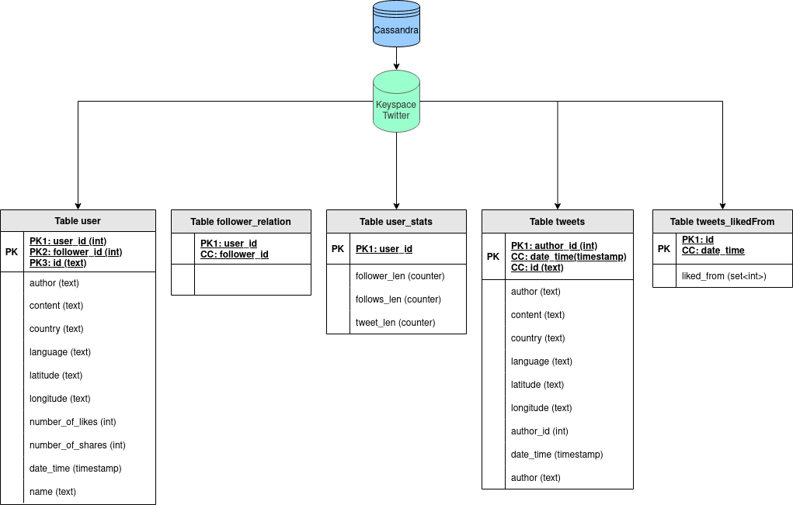

# Table Structure

* When first importing the data into Cassandra we ran into the follwing problem: `Failed to import 1 rows: ParseError - Failed to parse 5.34896E+17 : invalid literal for int() with base 10: '5.34896E+17',  given up without retries 'builtin_function_or_method' object has no attribute 'error'`. In order to fix this we had to manipulate the data before the import manually.
* We had to change the data schema a lot of times and try out driffent combination to make the querries work. We end up to use the realation table with the realationship between user_id,follower_id and tweet_id which build the primary key. So the data will be saved multiple times for eacht id and get around 45 times larger thand the orginal data. Addtionly we also use a stats table with counter to get a faster querry for the length of follower or follows. Because of the "world-search"-querry (task 6) we also add the tweets in a separate table to be able to run a index on the content col and filter with the LIKE-keyword.
* UDTs: We tried to load the tweet as UDTs to the above data schema. To perform the this we updated the structure of the combined csv-file after [this-stackoverflow post](https://stackoverflow.com/a/34364604) but always get an error for columns missmatch. We assume the content in the UDTs was not quoted so `,` in the conent section cause these erros.
* The only materialized view we used is for the exercies 5 to get a fanout-like style, that updates after a new tweet is added.
* SASI-index are (like most of the thinga) experimental and are not recommened for production use. However we had to use it for the exercies 6 to enable the searching with the `LIKE`-statment. We assume that cassandra make a intern table with each word associated with the tweets row in which its appears, since the index take around 5 minutes to create.
